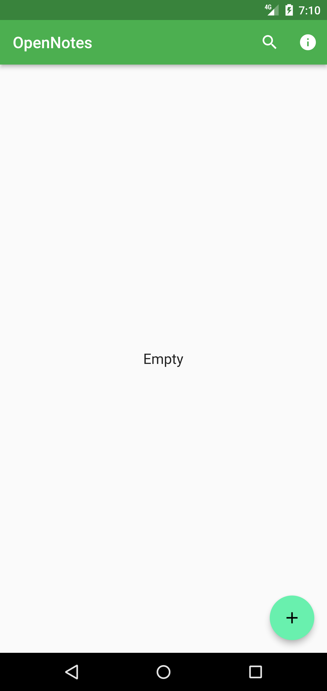
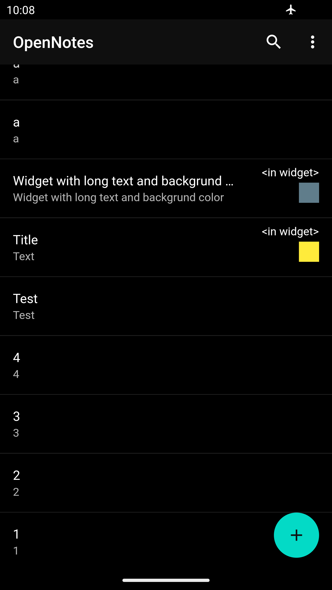
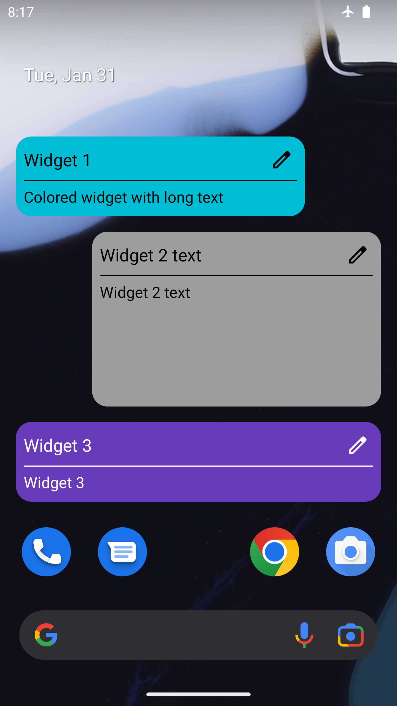

# OpenNotesMirror - Public mirror for the OpenNotes android application project

```
   ____                   _   __      __           
  / __ \____  ___  ____  / | / /___  / /____  _____
 / / / / __ \/ _ \/ __ \/  |/ / __ \/ __/ _ \/ ___/
/ /_/ / /_/ /  __/ / / / /|  / /_/ / /_/  __(__  ) 
\____/ .___/\___/_/ /_/_/ |_/\____/\__/\___/____/  
    /_/
```

Open-source non-commercial software without any licence which would let usage (including commercial),
distribution, redistribution, modification of this code/software - this software is not free (yet).

There are no analytics, advertisements or payments in this application.

Download is available at https://play.google.com/store/apps/details?id=com.sout.android.notes

# Description

This application lets saving and editing text notes to keep plain text information.
It also can be used to create various reminders such as status bar attachment, timed reminder which
will notify once in a certain time after it's creation, scheduled reminder which is an advanced type
of the timed reminder - it will notify starting the initial time with the provided time intervals
until cancelling and widget reminder. A color can be assigned to any note, it will be also assigned to
a widget. Canvas notes - images that a user can draw (him/her)self. The app supports two graphical themes
 - light and dark.

This is a next generation of the my Notes application 
(https://github.com/vadniks/MyAndroidProjectsPublicMirror/tree/master/Notes2.02%20(Suspended)).

# Screenshots




")






